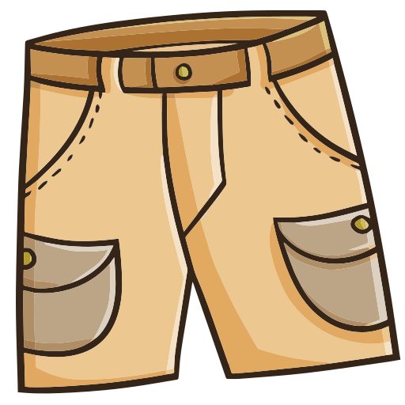

<html lang="th">
<head>
  <meta charset="UTF-8">
  <title>Character Dress-Up Test</title>
  
</head>
<body>

<h1>ทดลองแต่งตัวตัวละคร</h1>

  
  
  

<h2>Inventory</h2>

  <!-- ปุ่ม Base -->
  <button onclick="equip('base', 'image/base.png')">Base</button>
  <!-- ปุ่ม Hat -->
  <button onclick="equip('hat', 'image/hat1.png')">หมวกแดง</button>
  <button onclick="equip('hat', 'image/hat2.png')">หมวกฟ้า</button>
  <!-- ปุ่ม Shirt -->
  <button onclick="equip('shirt', 'image/shirt1.png')">เสื้อเหลือง</button>
  <button onclick="equip('shirt', 'image/shirt2.png')">เสื้อเขียว</button>

</body>
</html>
